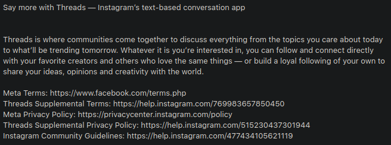
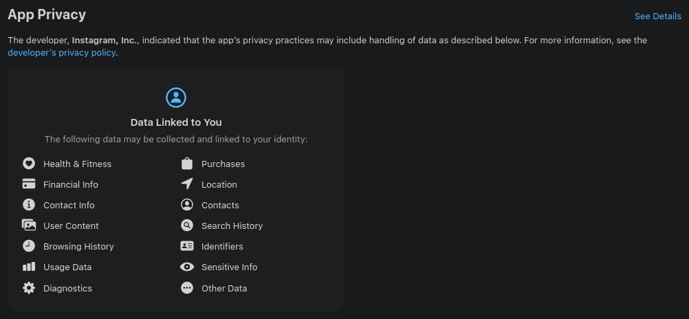
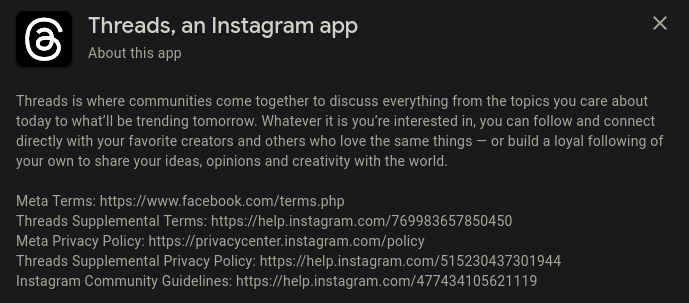
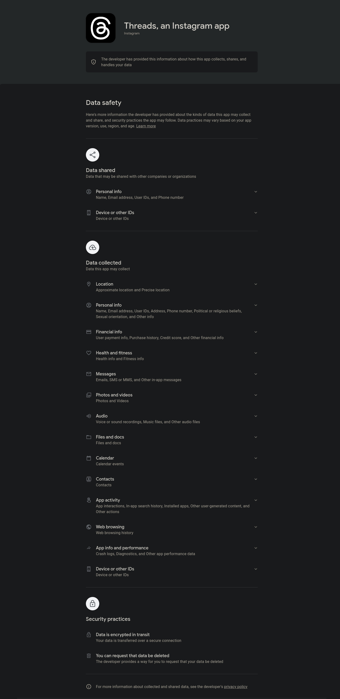

# What's This About

Meta is planning on joining the Fediverse via a project called Project 92, or P92 for short. Many people including myself know how Meta is bad when it comes to respecting human rights. I'm not even just talking about [Cambridge Analytica][cambridge-analytica], but am talking about the [genocide which Meta helped perpetuate such as in Myanmar][rohingya-genocide]. [Meta also has a history of mistreating queer people][lgbt-discrimination] and that's not even including the ["real" name policy][real-name-policy]. Of course, for me, I say that the name the person tells you is there name, is there real name. Not the name they were born with or their legal name, but the name that the person identifies with. 

To help explain why the reaction is so strong against Meta, it helps to know that the Fediverse is very, very queer. The Fediverse is made of people, including LGBT people who had to flee from other platforms due to the abuse they've received from the platforms they used to be on. This includes the large influx of people which came from Twitter when Musk took over and started implementing transphobic policies and hiding trans people's tweets while allowing transphobic tweets and slurs to proliferate. Meta only wants to connect to the Fediverse because they see it as a means to make a profit, and they'll do that no matter how much it harms people or tears about the community. Also, Meta has and will provide data to law enforcement without a second thought. They have done [this for abortion][facebook-abortion-police] and with the active criminalization of LGBT rights, such as making it illegal for [trans people to use the restroom in Florida][florida-bathroom-ban], giving data from LGBT people to Meta is effectively a death sentence in some cases.

You can read more about Meta and the Fediverse at the article, [Should the Fediverse welcome its new surveillance-capitalism overlords?][fediverse-surveillance-capitalism]

You can also check out [the pact against Meta][fedipact] as well as [the explanation for the pact][fedipact-explanation].

There's also an [article which explains why the Fediverse is very much against Meta joining][meta-and-mastodon-article].

If you're interested in [Google and XMPP, see this article][killing-decentralized-network].

# What's This Repo

This repo is a means to forcibly remove Meta from the Fediverse, by any means necessary. I've started this to collect a list of ip addresses which are owned by Meta and then to block Meta in ways that'll make life much more difficult for them. This includes silently dropping packets without notifying Meta, so their computers have to time out for each server which uses this method, as well as sending fake ActivityPub data to Meta and also throttling the connection, so as to slow their computers down and to make it harder for them to differentiate between which data is real, and which data is fake. It'll make their data much less valuable to anyone wanting to buy it.

This repo is hosted on [my Forgejo instance][forgejo-repo], [Codeberg][codeberg-repo], [Github][github-repo].

# Will They Actually Harm Me?

I'll let you read this info provided by Meta themselves.

<br>

## Description of Threads App on the Apple Store



If you can't read the image, I copied the text below.

```
Say more with Threads — Instagram’s text-based conversation app

Threads is where communities come together to discuss everything from the topics you care about today to what’ll be trending tomorrow. Whatever it is you’re interested in, you can follow and connect directly with your favorite creators and others who love the same things — or build a loyal following of your own to share your ideas, opinions and creativity with the world.

Meta Terms: https://www.facebook.com/terms.php
Threads Supplemental Terms: https://help.instagram.com/769983657850450
Meta Privacy Policy: https://privacycenter.instagram.com/policy
Threads Supplemental Privacy Policy: https://help.instagram.com/515230437301944
Instagram Community Guidelines: https://help.instagram.com/477434105621119
```

<br>

## App Privacy Description on the Apple Store



As per usual, the text version is below.

```
App Privacy

The developer, Instagram, Inc., indicated that the app’s privacy practices may include handling of data as described below. For more information, see the developer’s privacy policy.
Data Linked to You

The following data may be collected and linked to your identity:

* Health & Fitness
* Purchases
* Financial Info
* Location
* Contact Info
* Contacts
* User Content
* Search History
* Browsing History
* Identifiers
* Usage Data
* Sensitive Info
* Diagnostics
* Other Data
```

<br>

## Description of Threads App on the Google Play Store



The text version of the screenshot is below.

```
Threads, an Instagram app

About this app

Threads is where communities come together to discuss everything from the topics you care about today to what’ll be trending tomorrow. Whatever it is you’re interested in, you can follow and connect directly with your favorite creators and others who love the same things — or build a loyal following of your own to share your ideas, opinions and creativity with the world.

Meta Terms: https://www.facebook.com/terms.php
Threads Supplemental Terms: https://help.instagram.com/769983657850450
Meta Privacy Policy: https://privacycenter.instagram.com/policy
Threads Supplemental Privacy Policy: https://help.instagram.com/515230437301944
Instagram Community Guidelines: https://help.instagram.com/477434105621119
````

<br>

## App Privacy Description on the Google Play Store



As per usual, the text version is below.

```
Threads, an Instagram app

# Data shared
## Data that may be shared with other companies or organizations

* Personal info
## Name, Email address, User IDs, and Phone number

* Device or other IDs
## Device or other IDs

# Data collected
## Data this app may collect

* Location
## Approximate location and Precise location

* Personal info
## Name, Email address, User IDs, Address, Phone number, Political or religious beliefs, Sexual orientation, and Other info

* Financial info
## User payment info, Purchase history, Credit score, and Other financial info

* Health and fitness
## Health info and Fitness info

* Messages
## Emails, SMS or MMS, and Other in-app messages

* Photos and videos
## Photos and Videos

* Audio
## Voice or sound recordings, Music files, and Other audio files

* Files and docs
## Files and docs

* Calendar
## Calendar events

* Contacts
## Contacts

* App activity
## App interactions, In-app search history, Installed apps, Other user-generated content, and Other actions

* Web browsing
## Web browsing history

* App info and performance
## Crash logs, Diagnostics, and Other app performance data

* Device or other IDs
## Device or other IDs

# Security practices

* Data is encrypted in transit
## Your data is transferred over a secure connection

* You can request that data be deleted
## The developer provides a way for you to request that your data be deleted

For more information about collected and shared data, see the developer's privacy policy (http://instagram.com/legal/privacy)
```

Threads is currently live on the Android app. There's already hate organizations such as [PragerU][prageru] and [Libs of TikTok][lott]. PragerU was given a verified checkmark which is basically an endorsement when they are a well known hate organization. Both of these organizations want trans people dead and as the fediverse is very, very queer, especially with a lot of people being some flavor of trans, this just doesn't fly with the Fediverse. Also, if you look through both of their accounts, you can find posts like [this one where PragerU just openly harasses people and promotes it][prageru-harassment] and [this one where Libs of TikTok pretends that trans women aren't women][lott-transphobia] knowing full well that it was explained to her that trans women are in fact women and how most of society understands that fact.

* [Apple App Store Listing][apple-store-listing]
* [Google Play Store Listing][play-store-listing]
* [Website][threads-website]

# Does This Work?

As of the latest test at the time of writing this paragraph, I have confirmed that this script does block Meta's implementation of an ActivityPub server, threads.net.


For those who can't read the image, I pasted a copy of the output below.

```bash
# dig threads.net +short
31.13.65.52

# dig www.threads.net +short
threads.net.
31.13.65.52

# dig -x 31.13.65.52 +short    
instagram-p3-shv-01-atl3.fbcdn.net.

# python3 main.py -f plain | grep -i "31.13.65"
31.13.65.0/24
```

# How to Set This Project Up?

When setting up this project, you have to take your environment into consideration. This includes checking if you proxy your server with a proxy such as Cloudflare as well as determining what system you are running on your server as well as what commands and config files you have access to.

If servers connect to you your server directly and not through a proxy, and you are running on your own Linux server, you can likely use the iptables approach. The iptables approach downloads and formats the ip addresses for blocking with iptables. It even features different methods of blocking such as silently dropping the connection, giving a rejection message, and even redirecting the connection to a different server (both on and off the same computer).

```bash
# Dropping IP Addresses
python3 main.py -f iptables -p DROP | bash

# Routing IP Addresses To Port 8081
python3 main.py -f iptables -p DNAT -d :8081 | bash
```

If you have your own solution and can read formats such as plain text or jsonl, then you can output the ip addresses in those formats and then read them with your own software.

```bash
# Outputting IP Addresses as Plain Text
python3 main.py -f plain

# Outputting IP Addresses as JSONL
python3 main.py -f jsonl

# Help Command
python3 main.py --help
```

When outputting for Nginx with the geo list, make sure to have a check for the address within the `location /` block. An example output path for the config can be at `/etc/nginx/conf.d/meta-ip.conf`.

```conf
    location / {
        if ($meta_ip_address) {
            return 444;
        }
        
        # ...
    }
```

# What Else Can We Do?

* If you are an admin on a server, you can issue a block against threads.net. You can use any of the reasons mentioned in this ReadMe, such as enabling harassment and transphobia.

* If you are an individual user, you can block the domain from being able to interact with your account. This'll require the domain to federate first, so unlike the admin option which you can do now, this one will have to wait until Meta starts federating with the Fediverse.

  ## Demo of Blocking Domain as an Individual

  

  In order to block a domain as an individual, you'll have to look up an account from that domain. For example, you can use [Zuckerberg's account][zuck]. The user id should be [@zuck@threads.net][zuck]. Once you load it up in your instance, you can click the hamburger icon (three dots on top of each other) and then go down to where it says "Block domain threads.net". You then just confirm that you are fine with it and you'll have blocked the domain as an individual.

* You can always sign the [the pact against Meta][fedipact] as well as update people with new Meta instances via the #FediBlock hashtag. You can also contribute means of obtaining lists of Meta's servers by ip, and domain. This list can include both scrapers, and ActivityPub powered instances.

* You can also check out the [Free Fediverse][free-fediverse] project. It's a site of links to and about development projects, for a fediverse beyond stagnation, capitalist enclosure, and benevolent dictatorship.

* If you're a server owner, you can also update your .env.production file if you'd like to make it harder for others to read posts without authentication, however, this may make things less convenient for your denizens. I'd advise [reading about these options][authorized-fetch] and consulting with your denizens before you enable them.

```ini
AUTHORIZED_FETCH=true
DISALLOW_UNAUTHENTICATED_API_ACCESS=true
```

* If you're a software developer, you can contribute pull requests to help improve our protection against Meta.

* Also, anyone can share this repo with others on the Fediverse, so please share this and convince your admins to take action to protect their users. You can either share the [Github][github-repo] link or the [Codeberg][codeberg-repo] link.

I intentionally set everything in this repo as Public Domain (or [CC0 1.0 Universal](License.md) where Public Domain does not exist). This way anyone can work on improving this anti-Meta measure without restriction.

# Other Resources

* [ActivityPub Domain Block List][activitypub-domain-block-list]

# Future Ideas

* Sending Fake Data
* Abandon Session After SSL Negotiation
* [Fault Injection][fault-filter]
* Explicit Netfilter Support

[forgejo-repo]: https://git.catgirl.land/catgirl-land/block-meta-from-fedi
[github-repo]: https://github.com/lexi-the-cute/block-meta-from-fedi
[codeberg-repo]: https://codeberg.org/alexis/block-meta-from-fedi
[cambridge-analytica]: https://www.reuters.com/legal/facebook-parent-meta-pay-725-mln-settle-lawsuit-relating-cambridge-analytica-2022-12-23/
[rohingya-genocide]: https://www.amnesty.org/en/latest/news/2022/09/myanmar-facebooks-systems-promoted-violence-against-rohingya-meta-owes-reparations-new-report/
[lgbt-discrimination]: https://www.aclu.org/news/lgbtq-rights/facebooks-discrimination-against-the-lgbt-community
[real-name-policy]: https://www.eff.org/deeplinks/2014/09/facebooks-real-name-policy-can-cause-real-world-harm-lgbtq-community
[fediverse-surveillance-capitalism]: https://privacy.thenexus.today/should-the-fediverse-welcome-surveillance-capitalism
[fedipact]: https://fedipact.online
[fedipact-explanation]: https://fedipact.online/why
[instagram-privacy-policy]: http://instagram.com/legal/privacy
[apple-store-listing]: https://apps.apple.com/us/app/threads-an-instagram-app/id6446901002
[play-store-listing]: https://play.google.com/store/apps/details?id=com.instagram.barcelona
[threads-website]: https://www.threads.net/
[free-fediverse]: https://freefediverse.org
[authorized-fetch]: https://hub.sunny.garden/2023/06/28/what-does-authorized_fetch-actually-do/
[prageru]: https://www.threads.net/@prageru
[lott]: https://www.threads.net/@libsoftiktokofficial
[prageru-harassment]: https://www.threads.net/t/CuVohbUrs0c
[lott-transphobia]: https://www.threads.net/t/CuVobuboVKK
[zuck]: https://www.threads.net/@zuck
[meta-and-mastodon-article]: https://ianbetteridge.com/2023/06/21/meta-and-mastodon-whats-really-on-peoples-minds/
[killing-decentralized-network]: https://ploum.net/2023-06-23-how-to-kill-decentralised-networks.html
[facebook-abortion-police]: https://www.theverge.com/2022/8/10/23299502/facebook-chat-messenger-history-nebraska-teen-abortion-case
[activitypub-domain-block-list]: https://github.com/greyhat-academy/lists.d/blob/main/activitypub.domains.block.list.tsv
[florida-bathroom-ban]: https://www.erininthemorning.com/p/floridas-trans-bathroom-ban-signed
[fault-filter]: https://www.envoyproxy.io/docs/envoy/latest/configuration/http/http_filters/fault_filter
[nginx-drop-connection]: https://stackoverflow.com/a/21072774/21794394